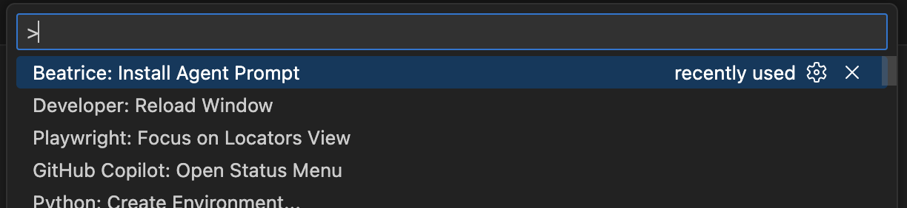
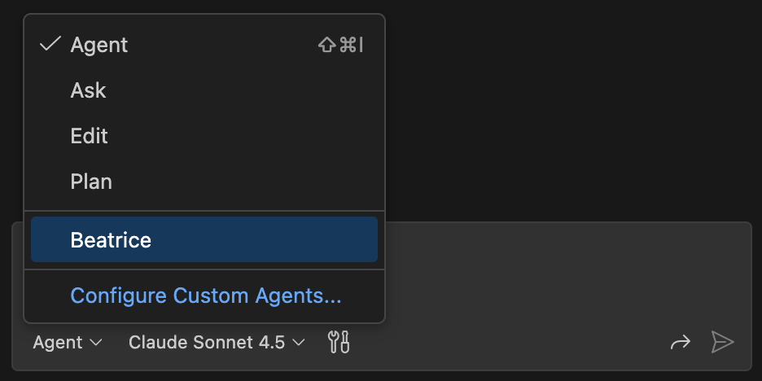
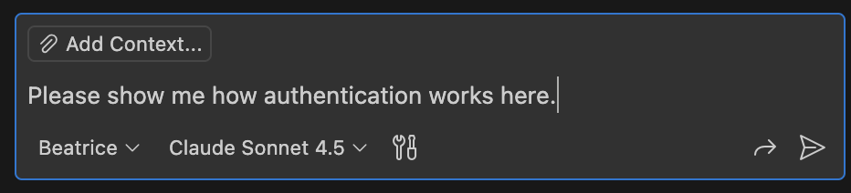

# Beatrice: Guided Code Tours

In the Divine Comedy, Beatrice guided Dante Alighieri through Paradise. Today, artificial intelligence can guide you through
the most heavenly (or hellacious) codebases.

Beatrice is a VS Code extension that provides guided code tours, using a GitHub Copilot custom agent. Instead of just answering questions in text,
Beatrice opens files, highlights code, and walks you through the codebase step by step.

## Status

This is experimental. But please give it a try!

## Requirements

You need GitHub Copilot, and of course VS Code. (Claude Code is great, but you really need a good IDE to do serious code exploration.)

## How to Use

### One-Time Repo Setup

From the command palette, run "Beatrice: Install Agent Prompt". This adds the custom agent prompt at `.github/agents/beatrice.agent.md`. Feel free to commit this to git.



### Tour Time!

Open a Copilot Chat session by clicking on the little speech bubble at the top of your VS Code window:


At the bottom of the Copilot Chat view, there's a popup menu labelled "Agent"; click on that and you'll see "Beatrice". Select it!



With the Beatrice agent selected, tell Beatrice what you'd like to learn about in your codebase.



### During a Tour

Beatrice will lead the tour, but it's still a conversation. Speak up if you don't understand something! Go on tangents!
You can ask to go to a previous step, or for modifications to the current tour plan, or even for a totally different tour.

And, you know, sometimes AIs get things wrong! If this happens, you can turn a tour
into a voyage of exploration!

Examples:

```
I didn't quite get the last thing you showed me. Please go back a step.
```

```
Can we change this to a tour of error handling in general?
```

```
Are you sure we don't do password-salting here? Can we explore a bit to make sure we're not missing something?
```